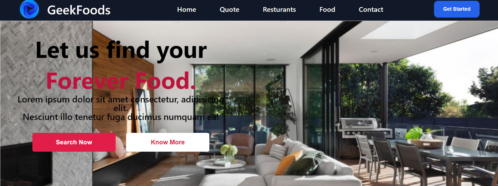
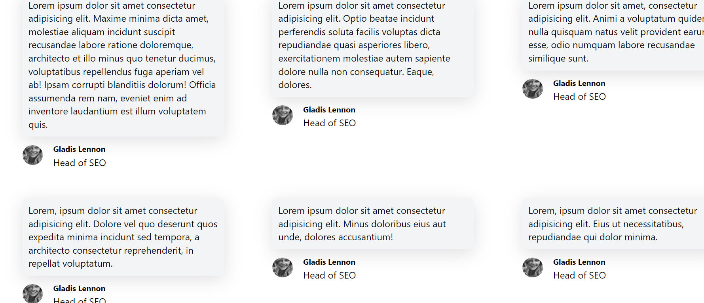
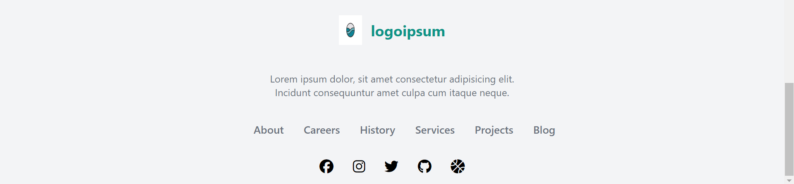

# Food React App
This is a simple React application that demonstrates the usage of components and props to create a user interface.

## Components
The application consists of the following components:-

### Navbar Component

Navbar component cosists all the page's link in it .

### Button Component

We see there are many buttons on project so we construct a Button Component.

### Footer Component

This component will display the footer section of website and will be same for other pages of the website .

## Preview

## Live Demo

You can access the live demo of this application [here](https://mohitnegi-react-day3c.netlify.app/).

## Conclusion

This application serves as a basic example of how React components can be used to create a user interface. By utilizing props, data can be efficiently passed between components, allowing for a modular and reusable code structure.
